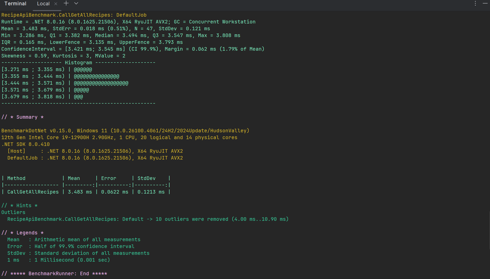

# Recipe Backend Application

This is a .NET-backed Recipe API application adhering to a clean architecture structure. The solution is organized to ensure separation of concerns, scalability, and maintainability.

---

## Table of Contents
1. [Architecture Overview](#architecture-overview)
2. [Setup Instructions](#setup-instructions)
3. [Rationale](#rationale)
4. [Running the Application](#running-the-application)
5. [Testing](#testing)

---

## Architecture Overview

The `Recipe Backend Application` has a layered architecture inspired by Clean Architecture. Below is a high-level overview of the layers:


- **Recipe.API:** The entry point of the application. It is the web layer that handles HTTP requests and responses.
- **Recipe.Application:** Contains the application logic, including use cases and business logic.
- **Recipe.Domain:** The core library housing domain models, enums, constants, and validations.
- **Recipe.Infrastructure:** Implements interfaces defined in the Application layer. This typically includes database context, configurations, and third-party services.
- **Recipe.Tests:** Contains unit and integration tests to maintain application quality.

---

## Setup Instructions

### Prerequisites
1. **.NET SDK 8.0 or newer:** Make sure you have .NET 8 installed. You can download it from [here](https://dotnet.microsoft.com/download).
2. **IDE:** Install [JetBrains Rider](https://www.jetbrains.com/rider/) or [Visual Studio 2022](https://visualstudio.microsoft.com/).
3. **Database:** Ensure a database server, such as SQL Server or PostgreSQL, is installed if required by the application.

### Steps to Setup Locally
1. Clone the repository:
   ```bash
   git clone <repository-url>
   cd Recipe-backend
   ```

2. Restore dependencies:
   ```bash
   dotnet restore
   ```

3. Build the solution:
   ```bash
   dotnet build
   ```

4. Update the database (if applicable):
   ```bash
   dotnet ef database update
   ```

5. Run the application:
   ```bash
   dotnet run --project Recipe.API
   ```

6. By default, the app will run on `http://localhost:5000`. Swagger (API documentation) is available at `http://localhost:5000/swagger`.

---

## Rationale

The key idea behind this architecture is to enforce separation of concerns and proper organization of code:
- **Scalability:** Layers can be modified, scaled, or replaced without affecting the other layers.
- **Testability:** Each layer can be tested independently (unit and integration testing).
- **Maintainability:** Organized codebase allows for faster onboarding and debugging.
- **Abstraction:** Core logic is independent of external frameworks or technologies, ensuring future adaptability.

---

## Running the Application

1. Navigate into the `Recipe.API` folder in your terminal.
2. Use this command to start the API:
   ```bash
   dotnet run
   ```
3. Access the API at `http://localhost:5000`.

---

## Testing

Unit and integration tests are in the `Recipe.Tests` project.

To run all the tests:

```bash
bash dotnet test
```


---

## BenchMark



If you encounter issues or need further support, feel free to raise an issue in the repository.
